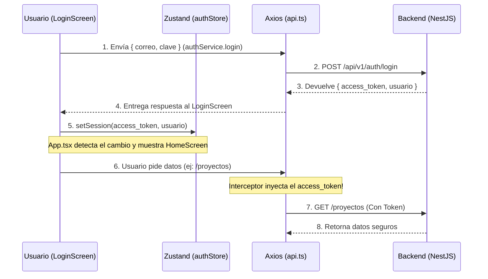

# 📚 Explicación: Flujo de Autenticación con JWT (Paso a Paso)

Este documento resume los últimos ajustes técnicos que hicimos para que el Login funcione en el celular, y explica de manera sencilla cómo está conectada toda la aplicación.

---

## 🔧 Los 3 Problemas que Arreglamos Hoy

Para que el celular pudiera iniciar sesión en el servidor (que estaba en tu computadora), solucionamos tres barreras invisibles:

1. **El Servidor (NestJS) era tímido:** Estaba configurado para escuchar solo peticiones de sí mismo (`localhost`). Lo cambiamos a `0.0.0.0` para que acepte conexiones de cualquier celular en la red Wi-Fi.
2. **El Guardaespaldas (Firewall de Windows):** Bloqueaba el puerto `3000`. Le creamos una regla para que deje pasar al celular.
3. **El Formato del Paquete:** El frontend esperaba que el token viniera envuelto en una caja llamada `datos` (`response.datos.token`), pero el backend lo estaba entregando suelto (`response.access_token`). Modificamos el tipado (`authService.ts`) y el `LoginScreen.tsx` para recibirlo correctamente.

---

## 🔑 ¿Qué es un JWT y cómo funciona en nuestra App?

Piensa en una discoteca exclusiva. 
- **El Usuario (Correo/Clave)** es tu DNI real.
- **El Backend (NestJS)** es el guardia de seguridad en la puerta.
- **El Token (JWT)** es el *sello fluorescente* que el guardia te pone en la mano una vez que revisa tu DNI.

No le vas a mostrar tu DNI al cantinero cada vez que pidas un trago; solo le muestras el sello fluorescente. El JWT funciona exactamente igual: evita que enviemos la contraseña del usuario en cada petición que hacemos al sistema.

### Así está estructurado nuestro código para manejar esto:

#### 1. Zod (`loginSchema.ts`)
Antes de siquiera acercarnos a la discoteca, verificamos que traes el DNI. Zod revisa que el formato del correo sea válido y la contraseña tenga 6 caracteres. **Si falla, ni siquiera molestamos al backend.**

#### 2. La Puerta (`authService.ts`)
Aquí es donde le entregas tu DNI al guardia.
`api.post('/auth/login', credentials)` viaja a tu backend. Si tus datos son correctos, el backend te devuelve:
- Tu perfil (Nombres, Apellidos, que eres `ADMINISTRADOR`).
- El **Token JWT** (Tu sello fluorescente).

#### 3. La Memoria (`authStore.ts` con Zustand)
¡Recibimos el sello! Pero si cerramos la app y la volvemos a abrir, ¿dónde lo guardamos?
Zustand es la "memoria" de la app. Llamamos a `setSession(token, usuario)`.
A partir de este momento, **toda la app sabe que hay un usuario logueado**.

#### 4. El Portero Automático (`App.tsx`)
`App.tsx` está vigilando a Zustand 24/7.
```tsx
const isAuthenticated = useAuthStore((state) => state.isAuthenticated);

{isAuthenticated ? <HomeScreen /> : <LoginScreen />}
```
Apenas Zustand dice *"Hey, recibí un token"*, `App.tsx` automáticamente quita la pantalla de Login y dibuja el `HomeScreen`. ¡Por eso no viste ningún código de navegación clásico!

#### 5. El Mensajero (`api.ts` Interceptor)
Ya estás dentro de la discoteca (HomeScreen). Ahora quieres pedir la lista de Proyectos Fotográficos.
El componente llama a `api.get('/proyectos')`.

Aquí ocurre la **magia del Interceptor de Axios** que programamos hoy:
```tsx
api.interceptors.request.use((config) => {
    const token = useAuthStore.getState().token;
    if (token) {
      config.headers.Authorization = `Bearer ${token}`;
    }
    return config;
});
```
El interceptor es un ayudante invisible que detiene la petición un milisegundo antes de salir, va a Zustand, saca tu Token JWT, se lo pega en la frente a la petición (`Bearer el_token_secreto...`), y la deja seguir al backend. El backend ve el token, sabe quién eres, y te devuelve los proyectos.

**¿Y si el sello se borró (token expirado)?**
El otro interceptor (el de respuesta) detecta si el backend responde con un Error `401 Unauthorized`. Si eso pasa, automáticamente borra la memoria (`clearSession()`) y `App.tsx` te patea de regreso al `LoginScreen`.

---

### Resumen Visual


